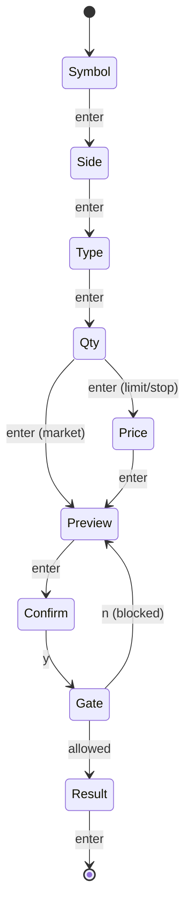

# Output Format — Walkthrough Template Spec

This document defines the exact markdown template for generated walkthrough documents. All walkthroughs produced by the GenerateWalkthrough workflow MUST follow this format.

---

## Document Structure

```
1. Header (metadata block)
2. Steps (repeated, one per state)
3. Footer (reference tables)
```

---

## 1. Header

```markdown
# [Workflow Name] Walkthrough

**Application:** [app name or binary]
**Platform:** [TUI | Web | Desktop | Mobile | CLI]
**Location:** [Tab N: Name | Route /path | Screen | Overlay | Standalone]
**Entry:** [key / URL / button / menu item]
**Steps:** [N]
**Total Interactions:** [N] (keys, clicks, gestures, etc.)
**Difficulty:** [Basic | Intermediate | Advanced]
**Prerequisites:** [None | specific state required]

> [One-sentence description of what this workflow accomplishes]
```

**Difficulty tiers:**
- **Basic** — Linear flow, < 8 interactions, no conditional branches
- **Intermediate** — Multi-step with choices, 8-15 interactions, some branches
- **Advanced** — Complex state machine, 15+ interactions, sub-components, async ops

---

## 2. Step Format (Repeated)

Each step in the workflow gets one section:

```markdown
## Step N: [Step Name] — [primary trigger]

[1-2 sentence description of what happens at this step. Include state transition info.]

**Source:** `[file]:[line range]` (`handler_function` / `view_function`)

[MOCKUP — see Mockup Format section for platform-appropriate style]

| Interaction | Action |
|------------|--------|
| [trigger] | [What it does] |
| [trigger] | [What it does] |

[Optional: notes about conditional behavior, async operations, or edge cases]
```

**Trigger format by platform:**
- **TUI:** `` `key` `` — e.g., `` `j`/`k` + `enter` ``
- **Web:** `[Button Label]` click, form submit, link `→ /route` — e.g., `[Continue] click`
- **Desktop:** `[Button]` click, `Cmd+S`, menu `File > Save` — e.g., `Cmd+N`
- **Mobile:** `[Button]` tap, swipe left, long press — e.g., `[Add to Cart] tap`
- **CLI:** `answer prompt`, `select option` — e.g., `select from list`

### Step Naming Convention

Convert the step identifier from source code to title case:
- Go: `wizardStepName` -> "Enter Name"
- Python: `Step.SYMBOL` / `"symbol"` -> "Enter Symbol"
- Rust: `Step::Symbol` -> "Enter Symbol"
- JS: `STEP_SYMBOL` / `"symbol"` -> "Enter Symbol"

### Conditional Steps

When a step is conditionally skipped, note it clearly:

```markdown
## Step 4: Set Price — `[digits]` + `enter`

> **Conditional:** This step is SKIPPED when order type is "market". Only appears for limit, stop, and stop-limit orders.
```

### Async Steps

When a step involves async operations (callbacks, promises, commands):

```markdown
## Step 7: Calendar Gate — automatic

> **Async:** The system automatically checks the economic calendar. A spinner appears while loading. If a high-impact event is detected, you must confirm with `y` or cancel with `n`.
```

---

## 3. Mockup Format

Choose the mockup format that best matches the platform. Use **one format consistently** within a single walkthrough.

### Format A: ASCII Box (TUI / CLI)

For terminal UIs. Uses Unicode box-drawing characters.

```
┌───────────┐   Top-left, horizontal, top-right
│           │   Vertical sides
├───────────┤   T-junction (section dividers)
└───────────┘   Bottom-left, horizontal, bottom-right
```

**Width:** Standard 55, narrow 40, full 70 characters inner content.

**UI elements:**
```
│  ▸ Buy         (selected)   │   Radio buttons
│  [x] US Large  (checked)    │   Checkboxes
│  > AAPL_       (cursor)     │   Text input
│  ████████░░░░  50%          │   Progress bar
│  ▼ Equities                 │   Expanded tree
│  ► Fixed Income             │   Collapsed tree
│  ⠋ Loading...               │   Spinner
│  j/k:nav  enter:next        │   Nav hints
```

### Format B: HTML Wireframe (Web)

For web applications. Uses indented HTML-like structure with annotations.

```
┌─ /checkout/shipping ──────────────────────────────┐
│                                                    │
│  ┌─ <header> ───────────────────────────────────┐ │
│  │  CHECKOUT  [1.Shipping] → 2.Payment → 3.Done │ │
│  └──────────────────────────────────────────────┘ │
│                                                    │
│  ┌─ <form> ─────────────────────────────────────┐ │
│  │  Full Name     [ John Doe            ]       │ │
│  │  Address       [ 123 Main St         ]       │ │
│  │  City          [ San Francisco       ]       │ │
│  │  State  [ CA ▾ ]    ZIP  [ 94102     ]       │ │
│  └──────────────────────────────────────────────┘ │
│                                                    │
│  [ ← Back ]                    [ Continue → ]      │
│                                                    │
└────────────────────────────────────────────────────┘
```

**Annotations:** `▾` = dropdown, `[ text ]` = input field, `[ Label ]` = button, `(●)/(○)` = radio, `[✓]/[ ]` = checkbox.

### Format C: Screen Layout (Desktop / Mobile)

For native apps. Uses simplified wireframe with platform conventions.

```
┌─ Window: New Portfolio ────────────── [−][□][×] ─┐
│  ┌─ Menu Bar ──────────────────────────────────┐ │
│  │  File   Edit   View   Portfolio   Help      │ │
│  └─────────────────────────────────────────────┘ │
│                                                   │
│  Account Type                                     │
│  ┌─────────────────────────────────────────┐     │
│  │ (●) Paper Trading                       │     │
│  │ (○) Taxable Brokerage                   │     │
│  │ (○) Roth IRA                            │     │
│  └─────────────────────────────────────────┘     │
│                                                   │
│  [ Cancel ]                      [ Next → ]       │
└───────────────────────────────────────────────────┘
```

### Format D: Mermaid Flow (Any platform — for complex branching)

When the state machine has too many branches for step-by-step mockups, add a Mermaid diagram to the header or footer:

````markdown

````

### Format E: CLI Prompt (Interactive CLI wizards)

For tools like Inquirer.js, Enquirer, promptui:

```
? Select account type: (Use arrow keys)
❯ Paper Trading — simulated, no real capital
  Taxable Brokerage — standard margin account
  Roth IRA — tax-free growth
  Traditional IRA — tax-deferred
```

### Mockup Rules (All Formats)

1. Every step MUST have exactly one mockup
2. Mockups show the screen state AFTER the step's trigger fires
3. Selection/focus indicators must reflect the initial state of that step
4. Navigation elements must match the actual UI output for that step
5. Use one format consistently within a single walkthrough
6. Use `...` for truncated content
7. **Box alignment:** Follow AsciiBox skill rules (see `~/.claude/skills/AsciiBox/CharacterReference.md` Alignment Rules). Validate with: `bun ~/.claude/tools/AsciiBox.ts validate <file>`

---

## 4. Footer

```markdown
---

## Quick Reference

### All Keys

| Key | Step/Context | Action |
|-----|-------------|--------|
| `[key]` | [Step N / Global] | [Action] |
| ... | ... | ... |

### Escape Paths

| From | Key | Goes To |
|------|-----|---------|
| Any step | `esc` | Previous step (or close if step 0) |
| Confirm | `n` | Back to Preview |
| ... | ... | ... |

### Related Workflows

- [Link to related walkthrough 1]
- [Link to related walkthrough 2]

### Related Tours

- [Tour stop name] — `.claude/TOUR.md` stop [N] ([brief relevance note])
- [Tour stop name] — `.claude/TOUR.md` stop [N] ([brief relevance note])

> **Cross-reference convention:** Walkthroughs link to tours (and vice versa) so users can move between "how do I do this?" (walkthrough) and "what can this do?" (tour) perspectives. If the project has no `.claude/TOUR.md`, omit this section.

---

*Generated by WorkflowDoc — source: `[primary source file]`*
*Last updated: [YYYY-MM-DD]*
```

---

## 5. Worked Example — Settings Wizard Steps 0-1

This is the reference output that all walkthroughs should match in style and detail:

```markdown
# Settings Wizard Walkthrough

**Application:** TUI
**Location:** Overlay (accessible from any tab)
**Entry:** `s` from any tab
**Steps:** 6
**Total Keys:** 12
**Difficulty:** Intermediate
**Prerequisites:** None (name pre-fills from config if available)

> Configure application settings through the 6-step wizard: enter name, choose theme/language/timezone, preview, and confirm.

## Step 0: Enter Name — `s`

Press `s` to open the settings overlay. If a name is already saved in the configuration, the name field pre-fills automatically.

**Source:** `cmd/tui/wizard.go` (`handleNameStep` / `viewNameStep`)

┌─────────────────────────────────────────────────────┐
│  SETUP                                              │
│  1/6 name                                           │
│                                                     │
│  NAME                                               │
│  > _                                                │
│                                                     │
│  type name + enter:confirm  esc:close               │
└─────────────────────────────────────────────────────┘

| Key | Action |
|-----|--------|
| (letters) | Type name characters |
| `backspace` | Delete last character |
| `enter` | Confirm name, advance to Step 1 |
| `esc` | Close settings wizard |

## Step 1: Select Theme — `j`/`k` + `enter`

Choose the application theme. Use `j`/`k` (or arrow keys) to move the selection pointer, then `enter` to confirm.

**Source:** `cmd/tui/wizard.go` (`handleThemeStep` / `viewThemeStep`)

┌─────────────────────────────────────────────────────┐
│  SETUP — Jane                                       │
│  2/6 name ▸ theme                                   │
│                                                     │
│  THEME                                              │
│  ▸ Light        clean, high-contrast                │
│    Dark         easy on the eyes                    │
│                                                     │
│  ↑/↓:select  enter:confirm  esc:back               │
└─────────────────────────────────────────────────────┘

| Key | Action |
|-----|--------|
| `j`, `down` | Move selection down |
| `k`, `up` | Move selection up |
| `enter` | Confirm theme, advance to Step 2 |
| `esc` | Back to Step 0 (Name) |
```

---

## Naming Convention for Output Files

Walkthrough files are saved to `docs/walkthroughs/` with kebab-case names:

| Workflow | Filename |
|----------|----------|
| Setup Wizard | `setup-wizard.md` |
| Settings Panel | `settings-panel.md` |
| User Onboarding | `user-onboarding.md` |
| Data Import | `data-import.md` |

---

## 6. YAML Source of Truth

Walkthrough data is stored in structured YAML before rendering to markdown. The YAML schema is the authoritative definition of walkthrough content.

**Schema:** `YAMLSchema.md` — full field reference, constraints, and examples.

**Pipeline:** Source code analysis → `.claude/walkthroughs/{id}.yaml` → `docs/walkthroughs/{id}.md`

**File locations:**
- YAML (machine-local, gitignored): `.claude/walkthroughs/*.yaml`
- Markdown (version-controlled): `docs/walkthroughs/*.md`

**Rendering:** The `RenderWalkthrough` workflow deterministically transforms YAML → markdown. Same YAML always produces identical markdown. See `Workflows/RenderWalkthrough.md` for the rendering rules.

**Type discriminator:** `type: linear` (sequential steps) or `type: modal` (concurrent key surfaces). Linear walkthroughs use `steps`, modal walkthroughs use `sections`.

**Agent consumption:** Agents read YAML directly via structured paths (e.g., `walkthrough.steps[3].interactions[0].trigger`). The markdown rendering is for human readers only.
